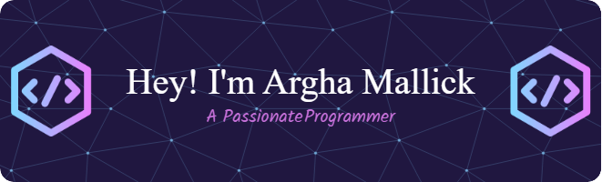

  

## Its just a Mere Beginning🔥💥

  

  

 

---

- 🌱 I’m currently learning **Mechine Learning, Backend Development With latest Technologies**.

- ❤️ I'm Currently Persuing my **BTech** in **Computer Science and Engineering (CSE)**.

- 🔥 I've started Exploring the Field of GoogleCloud as well ✨ and Hope to Contribute to that Field as well.

- 💬 Ask me about **GoogleCloud Programs, Python, Java, JavaScript, C , C++ etc**

- 📫 How to reach me **contact.arghamallick@gmail.com**

- 🔥🔥 Have a look at [**My Portfolio**]( https://iamarghamallick.github.io/portfolio) and contact me from there! 🔥🔥

---

<h3 align="left">Connect with Me</h3>

----

<h3 align="center">Languages and Tools</h3>
 

  
  
  
  
  
  

  
  
  
  
  
  
  
  

 
 

----
### Front-end Dev skills:

  
  
  
  
  
  
  
  

----

### Back-end Dev skills:

  
  
  
  
  
  

----

<h3 align="left">Support Me</h3>

  

 
 
 

  

  

  

---

 

  

----

 

----

